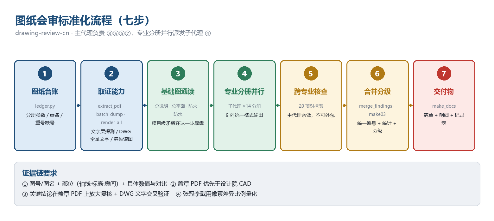
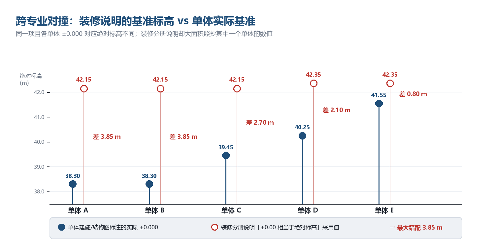
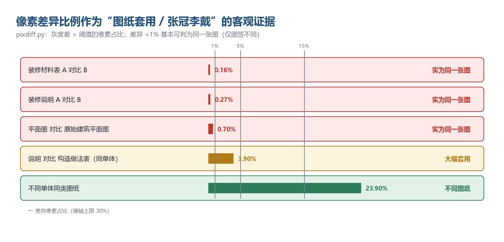

# 一次施工图会审的自动化实践：从千余张图纸到 703 条问题

> 面向中国建筑工程的"图纸会审"（施工图自审），把靠个人经验翻图的工作，做成可复现的工程化流程。
> 本文是开源技能 [drawing-review-cn](../../README.md) 的实战复盘，所有项目信息已脱敏。

---

## 一、问题的起点：图纸"读不了"

图纸会审是施工前必须完成的一道程序：施工、监理、建设、设计四方坐在一起，把整套施工图里
**错、漏、碰、缺**逐条提出来，形成会审记录，作为后续施工与结算的依据。

传统做法是"人海战术"：各专业工程师分头翻图，凭经验记问题，开会念清单。
问题在于：

- **量太大**。千余个 PDF（去重后千余张唯一图）+ 225 个 DWG。
- **跨专业的东西最容易被漏**。单专业挑错不难，难的是发现"A 专业的某参数和 B、C 专业的对不上"。
  而恰恰是这类问题，后期返工代价最高。
- **证据难固定**。"我觉得标高不对"在会上站不住脚；必须有图号、部位、具体数值。

更要命的是第一道技术门槛：**这批图纸的 PDF 大多"读不了"**。

我用 PyMuPDF 做了全量文字层探测，结果：

| 情况 | 现象 | 占比 |
|---|---|---|
| 文字层缺失 | `get_text()` 返回空——正文是矢量轮廓或扫描件 | 约 40% |
| 文字层乱码 | 抽取出 `ᔔㆇᇼᓜ` 这类无意义字符（CAD 出图缺 ToUnicode 映射） | 剩余中的大部分 |
| 可用 | 正常的少量说明类图纸 | 少数 |

也就是说，**靠"抽取 PDF 文字然后让模型读"这条路基本走不通**。
这是整个方案要解决的第一个问题。

---

## 二、方案总览：七步流程



流程的关键分工是：**主代理做 ③⑤⑥⑦，专业分册并行派发子代理做 ④**。

其中第 ⑤ 步"跨专业核查"是刻意**不外包**的——子代理各自只看一个专业分册，
看不到全局；而跨专业对撞恰恰需要全局视野。这是整个方案里最贵的一步，也是价值最高的一步。

---

## 三、取证工具链：当 PDF 读不了时

既然 PDF 不可靠，就换两条路取证。

### 3.1 主力手段：DWG 全量文字提取

设计院通常同时提供 CAD 源图。AutoCAD 自带无界面的 `accoreconsole.exe`，
可以用脚本批量打开每个 DWG，把**全部 TEXT / MTEXT / DIMENSION / ATTRIB 及其坐标**导出为文本：

```lisp
;; 核心：遍历整个图形数据库（含块定义），导出文字与坐标
(setq e (entnext))
(while e
  (setq ed (entget e))
  (if (= (cdr (assoc 0 ed)) "TEXT")
    (write-line (strcat "TEXT|" (cdr (assoc 8 ed)) "|"
                        (vl-princ-to-string (cdr (assoc 10 ed))) "|"
                        (cdr (assoc 1 ed))) f))
  (setq e (entnext e)))
```

这一步只花了一次成本（**225 个 DWG，5 路并行，约 30 分钟**），换来的是：
**可以对全项目 200 多张 CAD 图纸做关键词精确检索**。

```bash
# 全项目找"抗浮"——这是跨专业比对的主力动作
python scripts/gw.py "抗浮" 6 ""

# 找各单体的基准标高
python scripts/gw.py "±0.000(" 6 "01-建筑"

# 找某一类构造要求出现在哪些图纸
python scripts/gw.py "相当于绝对标高" 6 ""
```

效率对比很直观：逐张读图要几小时，检索 10 秒。

### 3.2 主力手段：渲染 + 图像识读

对没有 CAD 源图的图纸（以及需要看图面表达、图签、印章的场合），把 PDF 渲染成高分辨率 PNG
后逐张识读：

```bash
python scripts/render_all.py            # 千余张唯一图 → PNG（zoom 2.0）
python scripts/findpng.py "结构分册"  # 定位某张图
python scripts/crop.py "<某图号>" 0.33 0.75 0.62 0.88 out.png 6   # 局部放大 6 倍
```

放大这一步很关键：图签上的注册师执业印章有效期、表格里的小号数值、说明条文的下划线空白，
都必须放大 6～8 倍才能确认。

### 3.3 一个必须强调的原则

> **以经施工图审查机构盖章的 PDF 为准。**

设计院给的 CAD 常常是**更早的版本**。本项目就出现了：CAD 里结构总说明某参数栏是空白，
盖章版已经填了；CAD 里某处写 39.45，盖章版写 42.15。**只看 CAD 会得出错误结论。**

这条原则后来救了我两次（见第七节"自我更正"）。

---

## 四、跨专业对撞：最贵的发现都在这

第 ⑤ 步是整个流程的重点。20 项对撞清单里，最有效的是这几类：

### 4.1 基准标高：一个 3.85 米的错误

每个单体都有自己的 ±0.000（相对标高零点），对应不同的绝对标高；
而**室内装修分册的设计说明里有一句"本工程 ±0.00 相当于绝对标高 ___ m"**。

我做了全项目检索，把各单体的实际基准和装修说明里填的数值放在一起：



问题一目了然：**装修说明大面积照抄了其中一个单体的数值**。

| 单体 | 装修说明采用值 | 单体实际基准 | 差值 |
|---|---|---|---|
| A | 42.15 | 38.30 | **3.85 m** |
| B | 42.15 | 38.30 | **3.85 m** |
| C | 42.15 | 39.45 | **2.70 m** |
| D | 42.35 | 40.25 | **2.10 m** |
| E | 42.35 | 41.55 | **0.80 m** |

后果是系统性的：装修完成面标高、门窗洞口上下口、吊顶标高、机电点位与预留预埋全部错位。

### 4.2 结构标高高于建筑完成面

设计总说明写着"建筑面标高与结构标高关系详建施图"，但建施图里**没有这份对照表**。
逐层比对后发现：

| 单体 | 结构层楼面标高 | 建筑完成面 | 结论 |
|---|---|---|---|
| 某三层单体 | 三层 7.520 | 外廊 7.500 | 面层厚度为负 20mm |
| 某单体 | 一层顶板 4.350 | 3.400 | 差 950mm，无说明 |
| 某单体 | 脊梁顶 9.565 | 建筑脊 9.890 / 10.560 | 差 325mm，无构造层依据 |

### 4.3 消防系统："说明里做了，图里没做"

- 建筑防火设计说明：「地下室内设置自动喷水灭火系统全保护……地上部分设自动喷水灭火系统」
- 电气图：已经写了喷淋泵联动逻辑，还要求消控室显示消防水池与水箱水位
- 给排水全套：**无喷淋立管、无湿式报警阀、无水流指示器、无末端试水装置**

同一份建筑说明里还写着「本项目不设消防水池、水泵房及水箱」，系统为市政直供。

这类问题的通用检查动作是：**把"说明声称的系统"逐项拿到对应专业的系统图和材料表里去核**。

### 4.4 版本冲突：两套基础方案并行

送审盖章的基础图说明里**同时保留了桩基与筏板两套互斥内容**（承台/桩顶标高/桩数 + 底板厚度/配筋）；
另有日期早于审图章、但**未加盖施工图审查合格章**的设计变更（改为筏板 + 抗浮锚杆）。

检查动作：核对「变更单日期 vs 审图章日期」「变更单是否有审图章」「送审图是否已同步变更」。

### 4.5 设计范围 ≠ 送审范围

设计总说明明确写着「**室内二次精装修设计不在本次设计范围内**」「**建筑亮化设计不在本次设计范围内**」。
但送审盖章图纸集里，实际收录了 **165 张装修图** 和整套亮化图（另一家设计院、另一套图号体系）。

检查动作：**把"设计范围声明"当检查表用**，逐条与送审图纸集的实际分册对照——多了、少了都是问题。

### 4.6 木结构：问题不是"错"，是"没有"

全项目 110 个结构 PDF 里检索"木"，只命中景观专业的苗木表。
也就是说：**9 个木结构单体没有任何上部结构施工图**——没有柱、梁、屋架、檩条、斗栱的
构件编号、截面、材质等级、连接节点与计算。

同时，木结构基础的持力层取了"人工填土 60kPa"，而地勘报告的结论是
「场地填土较厚，**不宜采用天然地基，应采用桩基**」。

仿古/木结构项目里，**先清点"有没有"比"挑错"更重要**。

---

## 五、把"张冠李戴"变成可量化的证据

第四个高频问题是：**说明类图纸套用其他单体**。

本项目的实例：某单体的 `DI-01～DI-05`（设计说明、材料表、构造做法表）**五张全部属于其他单体**。
这类问题如果只靠肉眼比对，会审会上很难说服人（"看着差不多嘛"）。

所以我把判断做成了**像素级比对**——比较两张图灰度差超过阈值的像素占比：



结果非常干脆：

| 比较对象 | 差异像素占比 | 判定 |
|---|---|---|
| 装修材料表 A vs B | 0.16% | 实为同一张图 |
| 装修说明 A vs B | 0.27% | 实为同一张图 |
| 平面图 vs 原始建筑平面图 | 0.70% | 实为同一张图 |
| 不同单体同类图纸 | 23.9% | 不同图纸 |

**差异小于 1%，基本可以断定是同一张图换了图签。** 这个证据在会上无法反驳。

### 5.1 工具的性能设计

朴素实现有个陷阱：批量两两比对时，如果每一对都重新渲染，复杂度是 O(N²) 次渲染。
77 张图纸 = 数千对 = 5852 次渲染，不可行。

所以 `pixdiff.py` 做了三件事：

1. **页面位图只渲染一次并缓存** → O(N²) 次渲染降为 O(N) 次
2. **两级筛选**：先比 64×64 缩略图，明显不同的直接跳过
3. **numpy 向量化**差异计算（无 numpy 时自动退化为纯 Python）

实测（数十张图纸、数千对）：

| 版本 | 渲染 | 一级筛选 | 全分辨率比对 | 总用时 | 结果 |
|---|---|---|---|---|---|
| 朴素实现 | 5852 次 | — | — | 不可行 | — |
| 缓存 + 无筛选 | 77 次 | 0 对跳过 | 数千对 | 98.9 s | 109 对 ≥97% |
| **缓存 + 缩略图预筛** | 77 次 | **跳过 1996 对（68%）** | 930 对 | **56.6 s** | **109 对（完全一致）** |

预筛把时间砍掉 43%，且**没有任何漏检**。

### 5.2 这个工具额外发现了什么

压测结果不仅复现了子代理手工发现的套用问题，还成规模地暴露了一个模式：

```
差异 0.30%  A-11-P-04-墙材图.pdf              ↔  A-8-P-01-原始建筑平面图.pdf
差异 0.35%  B-11-P-04-一层平面布置图.pdf      ↔  B-8-P-01-一层原建筑平面图.pdf
差异 0.46%  C-8-P-B1-01-负一层原始建筑平面图.pdf ↔ C-9-P-B1-02-负一层平面图.pdf
差异 0.70%  ...
...（共百余对相似度 ≥ 97%）
```

即：**"原始建筑平面图"实际上是"平面图"的副本**——大量图纸之间只差标题和几条索引线。
这说明这些装修图并未真正表达装修布置，也无法作为"与建施一致性比对"的基准。

---

## 六、执行规模与产出

| 环节 | 数据 |
|---|---|
| PDF 文字层探测 | 千余个，约 40% 无可用文字层 |
| DWG 全量文字提取 | 225 个，5 路并行，约 30 分钟 |
| 图纸渲染 | 千余张 PNG |
| 专业分册子代理 | **15 个**（建筑 7 簇 / 结构 / 基坑 / 给排水电气 / 暖通智能化 / 装修 2 组 / 景观亮化） |
| **产出问题** | **703 条**（A 设计错误 130 · B 图纸矛盾 241 · C 深度不足 308 · D 施工建议 24） |
| 归纳 | **30 项一级问题** + **15 项跨专业矛盾** + **39 项需设计确认事项** |

交付物是标准四件套：

1. 知识体系与审查要点清单（方法论依据）
2. **问题清单（主件）**——审查结论、三级优先级、一级问题、跨专业矛盾、图纸集完整性核查
3. 各专业问题明细清单（703 条，统一编号）
4. **Word / Excel 会审记录表**——含"设计回复""处理结果""闭环状态"空列与四方签认栏

---

## 七、诚实记录：两次自我更正

流程里"盖章 PDF 优先"这条原则，让本项目发生了两次判断更正。我把它们写进了交付文件：

| 初期判断（基于设计院 CAD） | 核对盖章 PDF 后更正 |
|---|---|
| "结构总说明的 ±0.000 与抗浮设计水位栏空白" | 盖章版已填各单体 ±0.000；**真正空白的是"地下防水（抗渗）等级"栏**（5 个单体）。CAD 为更早版本，两版数值不同 |
| "海绵专业未纳入送审图纸集" | 海绵分册 **已在送审集内**（位于给排水文件夹、加盖审图章），只是未列入 SS 系列目录 |

写在交付文件里，比藏着更可信——**会审会议上，主动说明证据边界，比给出一个漂亮但错误的结论有价值。**

---

## 八、这套方法的边界

必须说清楚的三点：

1. **规范条文的时效性不保证**。脚本不内置条文库；不确定的条文一律标注"需核对"，
   最终以设计书面答复与施工图审查机构复核意见为准。
2. **它不是设计**。本方法的产出是"施工单位提出会审问题的依据"，不替代注册工程师的执业判断，
   也不替代危大工程的专家论证。
3. **扫描件只能读图**。无文字层且无 CAD 源图的图纸，无法逐条核对，必须在报告里写明证据边界。

---

## 九、怎么用到你自己的项目上

整套东西已经开源为 **drawing-review-cn**：

```bash
git clone https://github.com/Wonggeff/drawing-review-cn.git
cd drawing-review-cn
python -m pip install -r requirements.txt

python scripts/common.py --init     # 生成配置，填 drawing_root / out_dir
```

然后按七步走：

```bash
# ① 台账
python scripts/ledger.py
# ② 取证能力
python scripts/extract_pdf.py
pwsh -File scripts/batch_dump2.ps1      # 需 AutoCAD
python scripts/render_all.py
# ⑤ 跨专业核查（主力）
python scripts/gw.py "±0.000(" 6 "01-建筑"
python scripts/pixdiff.py --all "<装修分册>" --min-sim 97 --report r.md --csv r.csv
# ⑥⑦ 出件
python scripts/merge_findings.py && python scripts/make03.py && python scripts/make_docs.py
```

仓库里还有：

- `references/02-各专业审查要点.md` —— 11 个专业的检查清单，可直接粘进子代理提示词
- `references/03-跨专业碰撞与常见缺陷模式.md` —— 20 项对撞表 + 6 类缺陷模式库
- `CASE.md` —— 本文的脱敏案例版
- `SKILL.md` —— 技能主文件，支持 Claude Code / OpenCodex / DeepSeek Harness 等框架

**欢迎补充你所在专业的检查清单和踩过的坑** —— 见 [CONTRIBUTING.md](../../CONTRIBUTING.md)。

---

*本文所述项目信息均已脱敏；文中图片为脚本生成的示意图，不含任何真实项目数据。*

*配图生成脚本：[make_figs.py](make_figs.py)*
